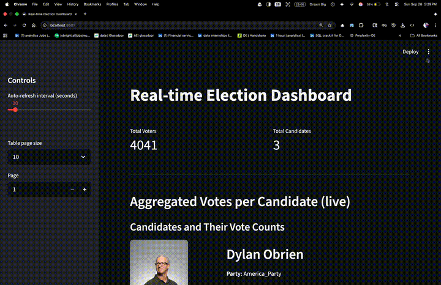

# 🗳️ Real-Time Voting Data Engineering Pipeline  
---

## 🚀 Overview  
This project simulates a **real-time voting system** and showcases how modern data engineering tools can be combined to build a live data pipeline.  

I created this project to **demonstrate end-to-end streaming data processing** — from data generation to real-time analytics and visualization.  

---
## 🎥 Demo Preview  

Here’s how the real-time election dashboard looks in action 👇  

  

## ✨ Features  
- 🔹 **Data Simulation** → Generates fake voter & candidate data  
- 🔹 **Kafka Producer & Consumer** → Streams votes in real-time  
- 🔹 **PostgreSQL** → Stores voters, candidates, and votes  
- 🔹 **PySpark Structured Streaming** → Aggregates votes & turnout in real-time  
- 🔹 **Streamlit Dashboard** → Live visualization of voting results (bar chart, donut chart, stats)  

---

## 🛠️ Project Structure  
.
├── main.py           
├── voting.py          
├── spark-streaming.py 
├── streamlit-app.py 
├── requirements.txt    
└── README.md     

---

## 🧰 Tech Stack  
- **Apache Kafka** → Event streaming backbone  
- **PostgreSQL** → Relational database for persistence  
- **PySpark** → Real-time aggregation with Structured Streaming  
- **Streamlit** → Interactive dashboard for visualization  
- **Python** → Glue for the entire pipeline  

---

## ⚡ How It Works  
1. `main.py` generates candidates & voters, then streams data into Kafka.  
2. `voting.py` consumes voter events → assigns votes → stores in PostgreSQL → produces vote events.  
3. `spark-streaming.py` aggregates votes per candidate & turnout by location.  
4. `streamlit-app.py` displays a **real-time election dashboard** with results.  

---

## 🎯 Why This Project?  
- To simulate **real-world data pipelines** used in companies like Uber, LinkedIn, and Netflix.  
- To demonstrate **real-time event streaming + analytics** in a clear and visual way.  
- To showcase **end-to-end data engineering skills**: ingestion, storage, processing, and visualization.  

---

👤 **Author:** Rakesh Goud Edigi  
📩 [LinkedIn Profile](https://www.linkedin.com/in/rakeshgoud-edigi)  
